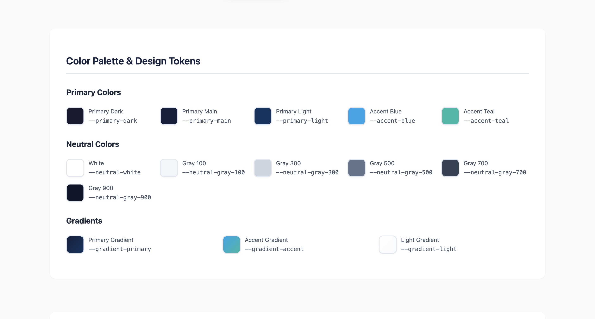
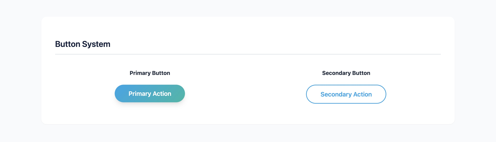
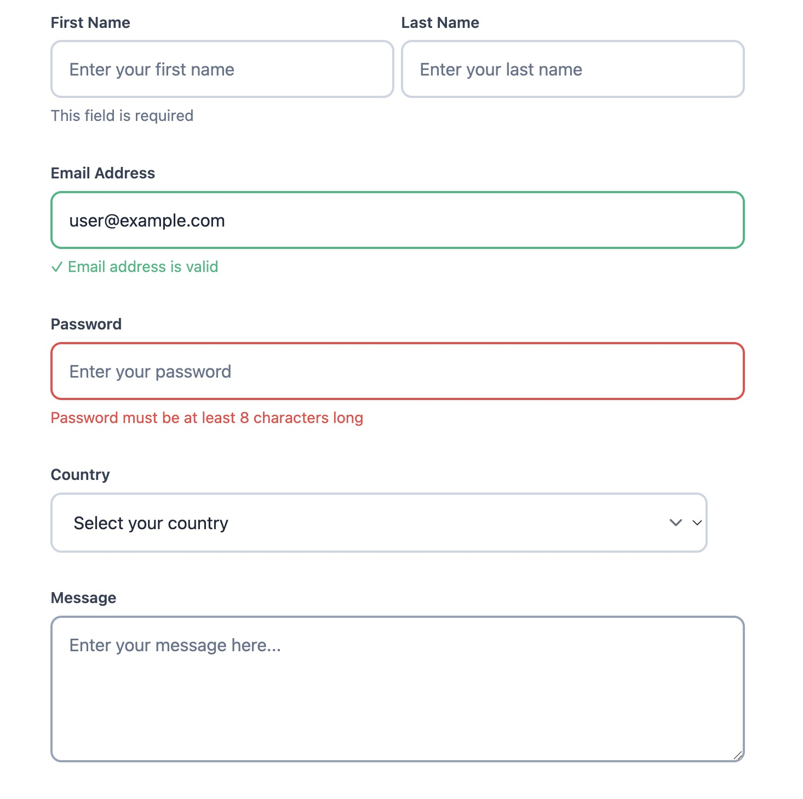
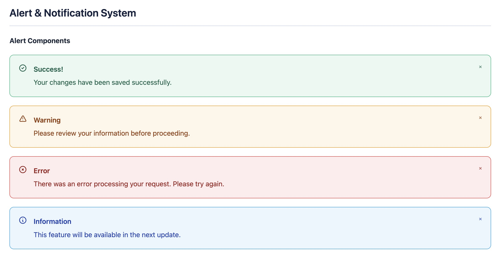

# Catalyst Design System






A clean, modern, and reusable CSS design system built with CSS custom properties (variables) and component patterns. Catalyst provides a comprehensive set of design tokens, UI components, and utilities for building consistent and beautiful web interfaces.

## ✨ Features

- **🎨 Comprehensive Design Tokens** - Colors, typography, spacing, shadows, and more
- **🧩 Reusable Component Patterns** - Cards, buttons, navigation, tags, and layout utilities
- **📱 Mobile-First Responsive Design** - Built with mobile responsiveness in mind
- **⚡ Modern CSS Features** - CSS Grid, Flexbox, custom properties, and gradients
- **🎭 Smooth Animations** - Hover effects, transitions, and keyframe animations
- **🔧 Utility Classes** - Grid system, layout helpers, and spacing utilities
- **🌈 Beautiful Color Palette** - Carefully crafted primary, accent, and neutral colors

## 🎨 Design Tokens

### Color Palette
- **Primary Colors**: Dark navy theme with `--primary-dark`, `--primary-main`, `--primary-light`
- **Accent Colors**: Modern blue and teal with `--accent-blue`, `--accent-teal`
- **Neutral Colors**: Complete grayscale from white to dark with proper contrast ratios
- **Gradients**: Beautiful preset gradients for primary, accent, and light themes

### Typography Scale
Fluid typography scale from `--font-size-xs` (1.2rem) to `--font-size-5xl` (4.8rem)

### Spacing System
Consistent spacing scale from `--space-xs` (0.5rem) to `--space-4xl` (8rem)

### Shadows & Effects
Five levels of shadows from subtle to dramatic, plus smooth transitions

## 🧩 Components

### Cards
```html
<div class="card">
  <!-- Card content -->
</div>

<div class="content-card">
  <!-- Content card with more padding -->
</div>
```

### Buttons
```html
<!-- Primary button with gradient -->
<button class="btn btn-primary">Primary Action</button>

<!-- Secondary outline button -->
<button class="btn btn-secondary">Secondary Action</button>

<!-- Icon button -->
<div class="icon-btn">
  <!-- Icon content -->
</div>
```

### Navigation
```html
<nav class="navbar">
  <div class="logo">Brand</div>
  <ul class="nav-links">
    <li><a href="#" class="nav-link">Home</a></li>
    <li><a href="#" class="nav-link">About</a></li>
    <li><a href="#" class="nav-link">Contact</a></li>
  </ul>
</nav>
```

### Typography
```html
<h1 class="section-title">Section Title</h1>
<span class="gradient-text">Gradient Text</span>
```

### Tags
```html
<span class="tag">Default Tag</span>
<span class="tag tag-accent">Accent Tag</span>
```

## 📐 Layout System

### Grid System
```html
<!-- Responsive grid system -->
<div class="grid grid-3">
  <div>Item 1</div>
  <div>Item 2</div>
  <div>Item 3</div>
</div>
```

### Container & Sections
```html
<div class="container">
  <section class="section">
    <!-- Section content -->
  </section>
</div>
```

### Utility Classes
```html
<!-- Flexbox utilities -->
<div class="flex">Flex container</div>
<div class="flex-center">Centered content</div>

<!-- Text alignment -->
<div class="text-center">Centered text</div>
```

## 🎭 Animations

### Built-in Animations
- **Fade In Up**: `animate-fade-in-up` class
- **Hover Effects**: Automatic on cards, buttons, and navigation
- **Smooth Transitions**: Applied consistently across components

### Custom Animations
The design system uses CSS custom properties for transition timing:
- `--transition-fast`: 0.15s ease
- `--transition-normal`: 0.3s ease  
- `--transition-slow`: 0.5s ease

## 📱 Responsive Design

Catalyst is mobile-first and includes:
- Responsive grid system that collapses on mobile
- Adjusted spacing and typography for smaller screens
- Touch-friendly button and interaction sizes

## 🛠️ Customization

### Override CSS Variables
```css
:root {
  /* Override any design token */
  --accent-blue: #your-color;
  --space-lg: 3rem;
  --radius-md: 0.5rem;
}
```

### Extend Components
```css
/* Create your own component variants */
.card-special {
  @extend .card;
  border: 2px solid var(--accent-blue);
}
```

## 🌟 Examples

Check out these example implementations:

### Hero Section
```html
<section class="section">
  <div class="container">
    <h1 class="section-title">
      Welcome to <span class="gradient-text">Modern Design</span>
    </h1>
    <div class="flex-center">
      <button class="btn btn-primary">Get Started</button>
    </div>
  </div>
</section>
```

### Feature Cards
```html
<div class="container">
  <div class="grid grid-3">
    <div class="card animate-fade-in-up">
      <h3>Feature One</h3>
      <p>Description of your feature</p>
      <span class="tag tag-accent">New</span>
    </div>
    <!-- More cards... -->
  </div>
</div>
```

## 🤝 Contributing

Contributions are welcome! Please feel free to submit a Pull Request. For major changes, please open an issue first to discuss what you would like to change.

## 📄 License

This project is licensed under the MIT License - see the [LICENSE](LICENSE) file for details.

## 🙏 Acknowledgments

- Inspired by modern design systems like Tailwind CSS and Material Design
- Built with love for the developer community
- Special thanks to the CSS Working Group for amazing CSS features

---

**Made with ❤️ for modern web development**

> ⭐ If you find Catalyst Design System helpful, please consider giving it a star on GitHub!
# Catalyst-Design-System
